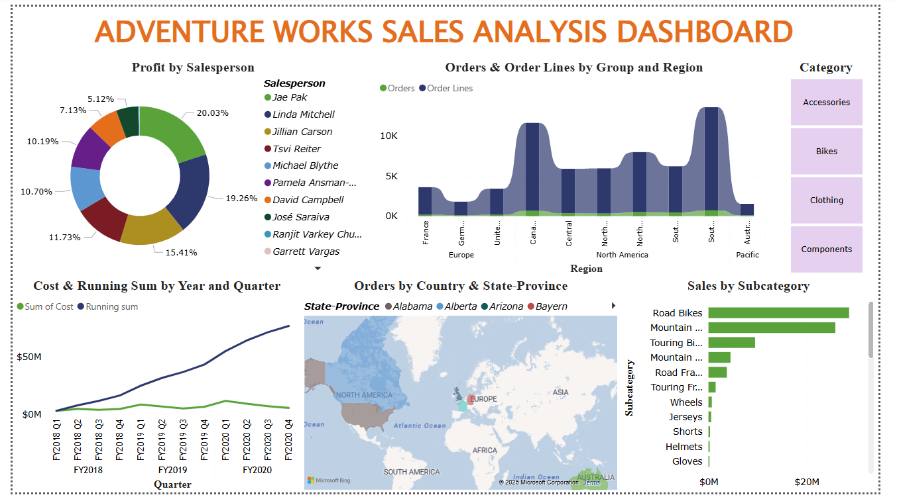

# 📊 Mini Project – Sales Analysis using Power BI

This project is a result of a hands-on **Power BI workshop** conducted at my college, where we built a complete end-to-end **Sales Analysis Dashboard** using the popular **Adventure Works** dataset. The project simulates a real-world business scenario analyzing sales performance data from a fictional retail company.

---

## 🏢 Project Background

- **Dataset**: Adventure Works (sample business dataset)
- **Domain**: Sales and Revenue Analysis
- **Duration**: ~2 days (Hands-on Workshop)
- **Tools Used**:
  - **SQL Server** – for data import (AdventureWorksDW2020.bak)
  - **Microsoft Excel** – some tables used in Power Query
  - **Power BI Desktop** – for complete report building

This project involved working on actual business questions using sales data containing metrics like:

- Revenue, Profit, and Targets
- Product Categories and Subcategories
- Regional Sales
- Time-based performance (monthly, yearly trends)

---

## 🧠 Modules Covered

This mini project was structured into clear modules as part of the workshop:

### ✅ Module 1: Importing Data
- Connecting to SQL Server and Excel files
- Importing multiple tables into Power BI Desktop

### ✅ Module 2: Data Cleaning & Transformation
- Removing nulls, renaming columns
- Filtering, formatting
- Using **Power Query Editor**

### ✅ Module 3: Building the Data Model
- Creating relationships between tables (Star Schema)
- Handling date and lookup tables

### ✅ Module 4: DAX Measures & KPIs
- Writing calculated columns and measures using DAX
- Sample: `Total Sales`, `Profit Margin`, `Sales vs Target`

### ✅ Module 5: Advanced DAX
- Time intelligence functions
- YTD, QTD, MoM growth calculations

### ✅ Module 6: Designing Visuals & Insights
- Creating interactive charts, cards, slicers
- Drill-downs and page navigation
- Finalizing the dashboard layout

---

## 📁 Folder Structure

```plaintext
/Mini-Project-Sales-Analysis/
│
├── Dataset/               # SQL and Excel files used
├── Module Manuals/        # Workshop instructions and notes
├── Report/                # .pbix file
└── Visuals/               # Screenshots or exported dashboard images
```
---

## 📈 Final Dashboard



---


### ⭐ Rate this project if you find it useful or inspiring.
